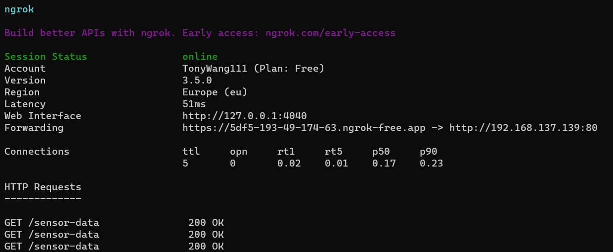

# IoT part

## Hardware

- I used ESP32, DHT22, and TEMT6000 to create a simple device for measuring light level, humidity, and temperature.
- The pin connections are as follows: 

DHT22:VDD connected to 3V; DATA connected to pin13;GND connected to GND.

TEMT6000:VCC connected to 3V; SIG connected to pinA3; GND connected to GND.

## Software(Arduino)

- Our idea is to utilize the WiFi capabilities of the ESP32 to create a mini web server on it and use this server to transmit the measured data.

- However, the URL for accessing this data can only be accessed within the local network and is not accessible on the public internet.

- So, we used the ngrok to expose the locally running server to the public internet. And we get this URL:https://5df5-193-49-174-63.ngrok-free.app/sensor-data
